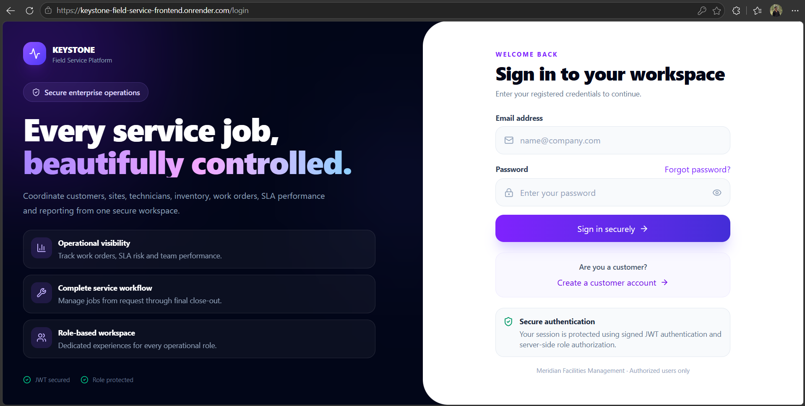
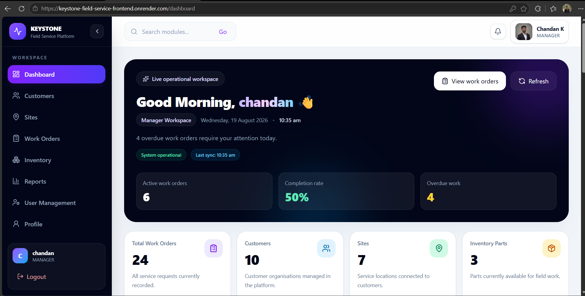
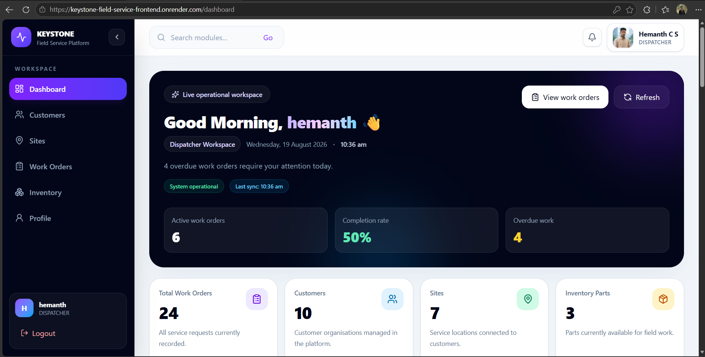
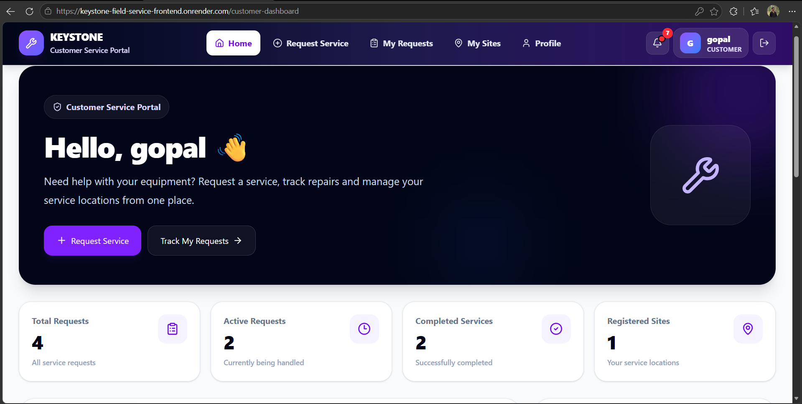
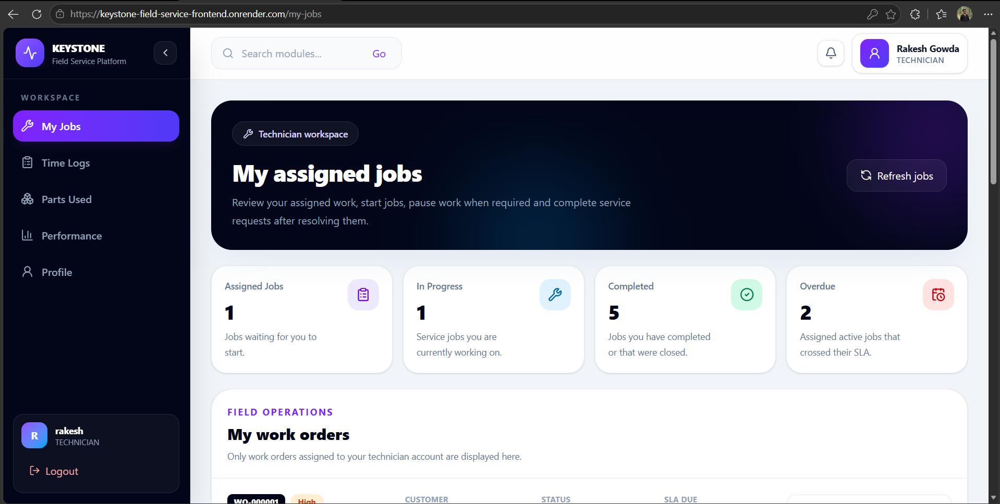
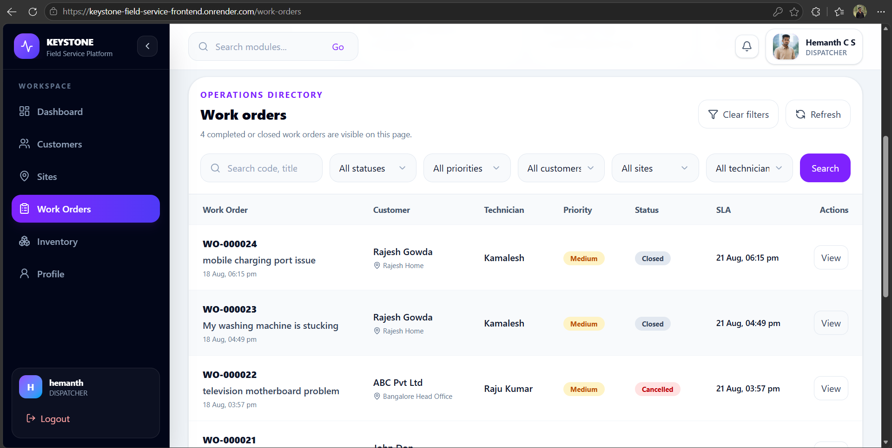
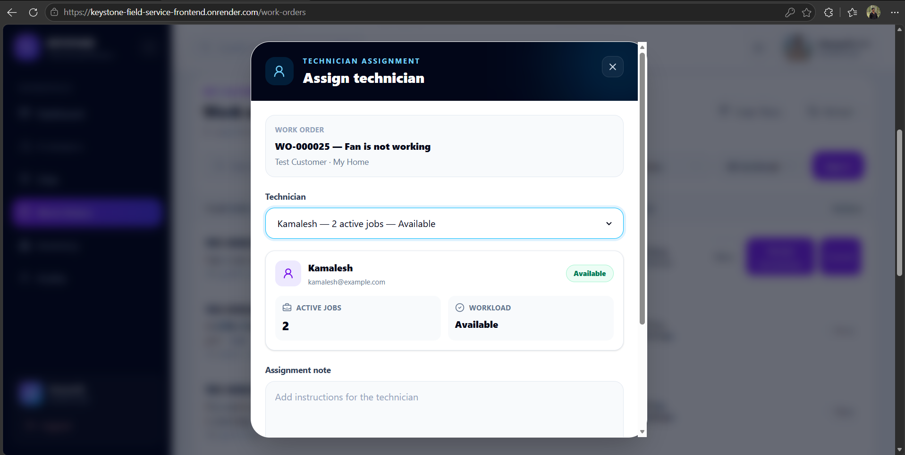
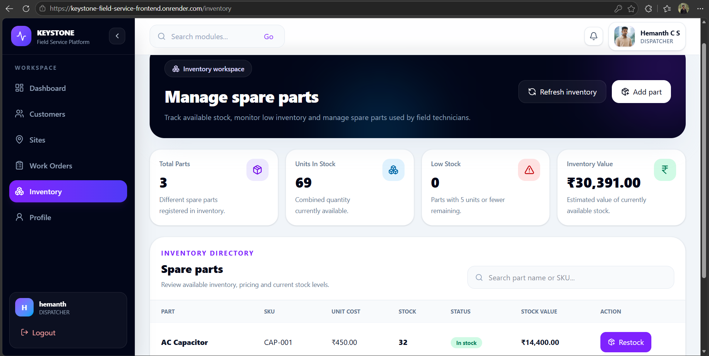

# ⚡ KEYSTONE — Field Service Management Platform

<div align="center">

### A Full-Stack Field Service Management System

**Java • Spring Boot • React • MySQL • JWT • REST API**

Developed as part of the **Zidio Development Internship**

[🌐 Live Application](https://keystone-field-service-frontend.onrender.com) •
[⚙️ Backend API](https://field-service-management-system.onrender.com)

</div>

---

## 📖 About The Project

**KEYSTONE** is a full-stack Field Service Management Platform designed to manage and coordinate field-service operations from a centralized system.

The platform connects **Managers, Dispatchers, Technicians, and Customers** through dedicated role-based workspaces.

It supports the complete service lifecycle — from a customer submitting a service request, through work-order creation and technician assignment, to job completion and operational tracking.

The project was developed as part of the **Zidio Development Internship** with a focus on building a secure, responsive, scalable, and production-ready full-stack web application.

---

## 🚀 Live Application

### Frontend

🔗 https://keystone-field-service-frontend.onrender.com

### Backend

🔗 https://field-service-management-system.onrender.com

> **Note:** The application is hosted on Render's free tier. The first request may take additional time after a period of inactivity while the service starts.

---

# 📸 Application Screenshots

Below are screenshots demonstrating the major modules and role-based workflows of the KEYSTONE Field Service Management Platform.

---

## 🔐 Secure Login

Secure authentication interface for accessing the KEYSTONE platform.



---

## 👔 Manager Dashboard

Centralized dashboard for monitoring and managing field-service operations.



---

## 🎯 Dispatcher Dashboard

Dispatcher workspace for coordinating service operations, monitoring work orders, and managing technician assignments.



---

## 👤 Customer Dashboard

Customer workspace for requesting services and tracking field-service activities.



---

## 🔧 Technician Dashboard

Technician workspace for viewing assigned jobs and managing field-service activities.



---

## 📋 Work Order Management

Centralized work-order management interface for creating, viewing, tracking, and managing field-service jobs.



---

## 👨‍🔧 Technician Assignment

Dispatcher interface for assigning technicians to work orders and coordinating field-service operations.



---

## 📦 Inventory Management

Inventory module for managing field-service inventory and spare parts.



---

# 👥 User Roles

KEYSTONE implements four primary user roles with separate permissions and protected workspaces.

### 👔 Manager

The Manager has administrative and operational oversight of the platform.

**Capabilities:**

- View management dashboard
- Manage users
- Manage technicians
- Manage dispatchers
- Manage customers
- Monitor work orders
- Monitor field-service operations
- Manage inventory
- View operational information
- Manage account and profile information

### 🎯 Dispatcher

The Dispatcher coordinates day-to-day field-service activities.

**Capabilities:**

- View dispatcher dashboard
- Manage customers
- Manage service sites
- Create and manage work orders
- Assign technicians
- View technician workload and availability
- Monitor work-order status
- Manage inventory
- Coordinate operational workflows
- Receive notifications
- Manage profile information

### 🔧 Technician

Technicians handle assigned field-service jobs.

**Capabilities:**

- View technician dashboard
- View assigned work orders
- Access job information
- Start assigned jobs
- Update work-order progress
- Complete service jobs
- Receive notifications
- Manage profile information

### 👤 Customer

Customers have their own service workspace.

**Capabilities:**

- Register an account
- Securely log in
- Access customer dashboard
- Manage profile information
- Manage service sites
- Create service requests
- View service/work-order information
- Track service progress
- Receive notifications
- Upload and manage profile photo

---

# 🔄 Field Service Workflow

```text
Customer
   │
   ▼
Service Request
   │
   ▼
Dispatcher Reviews Request
   │
   ▼
Work Order Created
   │
   ▼
Technician Assigned
   │
   ▼
Assigned Work Order
   │
   ▼
Technician Starts Work
   │
   ▼
Work In Progress
   │
   ▼
Technician Completes Work
   │
   ▼
Work Order Completed / Closed
```

Role-based authorization is maintained throughout the complete workflow.

---

# ✨ Key Features

- 🔐 JWT-based authentication
- 🛡️ Role-based authorization
- 👤 Customer registration and secure login
- 📊 Role-specific dashboards
- 👥 Customer management
- 📍 Service-site management
- 👨‍🔧 Technician management
- 📋 Work-order management
- 🎯 Technician assignment
- 📈 Technician workload tracking
- 🔄 Work-order lifecycle management
- 📦 Inventory and spare-parts management
- 🔔 In-app notifications
- 📧 Email notifications
- 👤 User profile management
- 🖼️ Cloud-based profile-photo storage
- 🔑 Password management
- 🔒 Protected frontend routes
- 🌐 REST API integration
- ☁️ Cloud database integration
- 📱 Responsive user interface
- 🚀 Production deployment

---

# 🛠️ Technology Stack

## Backend

| Technology | Purpose |
|---|---|
| Java | Backend programming language |
| Spring Boot | Backend application framework |
| Spring Security | Authentication and authorization |
| Spring Data JPA | Database persistence |
| Hibernate | ORM |
| REST APIs | Frontend/backend communication |
| JWT | Stateless authentication |
| Maven | Dependency and build management |

## Frontend

| Technology | Purpose |
|---|---|
| React | User-interface development |
| Vite | Frontend development/build tooling |
| JavaScript | Frontend programming |
| HTML5 | Application structure |
| CSS3 | Styling and responsive design |
| Axios | REST API communication |
| React Router | Routing and protected navigation |

## Database & Cloud

| Technology | Purpose |
|---|---|
| MySQL | Relational database |
| Aiven | Production MySQL hosting |
| Render | Application deployment |
| Cloudinary | Persistent profile-image storage |
| Git | Version control |
| GitHub | Source-code hosting |

---

# 🔐 Authentication & Authorization

KEYSTONE uses **JWT-based authentication** together with **Spring Security**.

After successful authentication, users are granted access according to their assigned role.

```text
ROLE_MANAGER
ROLE_DISPATCHER
ROLE_TECHNICIAN
ROLE_CUSTOMER
```

Backend endpoints are protected using role-based authorization.

The React frontend also implements protected routes so users cannot access workspaces that do not belong to their role.

---

# 🏗️ System Architecture

```text
┌──────────────────────────────┐
│        React Frontend        │
│       Deployed on Render     │
└──────────────┬───────────────┘
               │
               │ REST API / JWT
               ▼
┌──────────────────────────────┐
│     Spring Boot Backend      │
│       Deployed on Render     │
└──────────┬───────────┬───────┘
           │           │
           │           │ Profile Images
           │           ▼
           │    ┌───────────────┐
           │    │  Cloudinary   │
           │    └───────────────┘
           │
           │ JPA / Hibernate
           ▼
┌──────────────────────────────┐
│       Aiven MySQL DB         │
└──────────────────────────────┘
```

The React frontend communicates with the Spring Boot backend through REST APIs. Authentication is handled using JWT tokens, while application data is persisted in the cloud-hosted MySQL database.

---

# 🗄️ Database

The production application uses a cloud-hosted **MySQL database on Aiven**.

Database integration is implemented using:

- Spring Data JPA
- Hibernate ORM
- MySQL Connector
- Environment-based production configuration

Sensitive production credentials are configured using environment variables and are not stored directly in the public repository.

---

# 🖼️ Cloud Profile Photo Storage

Profile pictures are stored using **Cloudinary** instead of the local application filesystem.

This allows uploaded profile pictures to remain accessible across:

- Browser sessions
- Different devices
- Backend restarts
- Application redeployments

The application stores the resulting image URL with the user's profile information.

---

# 🔔 Notification System

KEYSTONE provides notifications for important field-service activities, including:

- Work-order creation
- Technician assignment
- Work-order status changes
- Work-order completion

Email processing is handled asynchronously where applicable so that email delivery does not unnecessarily block important application operations.

---

# 📂 Project Structure

```text
Field-Service-Management-System/
│
├── field-service-frontend/
│   ├── public/
│   ├── src/
│   │   ├── components/
│   │   ├── pages/
│   │   ├── services/
│   │   └── ...
│   ├── package.json
│   └── vite.config.js
│
├── src/
│   └── main/
│       ├── java/
│       │   └── com/fieldservicemanagement/
│       │       ├── config/
│       │       ├── controller/
│       │       ├── dto/
│       │       ├── entity/
│       │       ├── exception/
│       │       ├── repository/
│       │       ├── security/
│       │       └── service/
│       │
│       └── resources/
│
├── screenshots/
│   ├── Login.png
│   ├── Manager-Dashboard.png
│   ├── Dispatcher-Dashboard.png
│   ├── Customer-Dashboard.png
│   ├── Technician-Dashboard.png
│   ├── Work-Orders.png
│   ├── Technician-Assignment.png
│   └── Inventory.png
│
├── Dockerfile
├── pom.xml
└── README.md
```

---

# 🌐 Deployment

The production application uses the following cloud architecture:

```text
React Frontend
      │
      ▼
    Render
      │
      ▼
Spring Boot REST API
      │
      ├──────────────► Cloudinary
      │
      ▼
Aiven MySQL Database
```

### Production Services

**Frontend:**  
https://keystone-field-service-frontend.onrender.com

**Backend:**  
https://field-service-management-system.onrender.com

---

# 🧪 Testing

The application was tested across the major role-based workflows.

Testing included:

- Authentication testing
- Authorization testing
- REST API testing
- Customer workflow testing
- Dispatcher workflow testing
- Technician workflow testing
- Manager workflow testing
- Work-order lifecycle testing
- Technician assignment testing
- Inventory operation testing
- Profile management testing
- Frontend/backend integration testing
- Production deployment testing

---

# 📚 Key Learning Outcomes

Developing KEYSTONE provided practical experience in:

- Designing a full-stack application
- Developing REST APIs with Spring Boot
- Building responsive interfaces with React
- Implementing JWT authentication
- Implementing role-based authorization
- Integrating frontend and backend applications
- Designing relational database workflows
- Managing field-service business logic
- Implementing cloud-based image storage
- Debugging frontend/backend integration issues
- Working with environment variables
- Deploying full-stack applications to cloud platforms
- Managing production database connectivity
- Using Git and GitHub for version control

---

# 🔮 Future Enhancements

Potential future improvements include:

- Real-time technician location tracking
- Route optimization
- Advanced reporting and analytics
- Customer feedback and rating system
- Mobile application support
- Real-time notification delivery
- Advanced SLA analytics
- Predictive maintenance
- Automated technician scheduling

---

# 🎓 Internship Project

This project was developed as part of the **Zidio Development Internship**.

The objective was to gain practical full-stack development experience by designing, implementing, testing, and deploying a real-world Field Service Management application.

---

# 👨‍💻 Developer

**Chandan K**

Java Full Stack Developer

**Project:** KEYSTONE — Field Service Management Platform  
**Internship:** Zidio Development

---

<div align="center">

### ⭐ KEYSTONE Field Service Management Platform

**Built with Java, Spring Boot, React & MySQL**

From service request to successful field-service completion.

</div>
